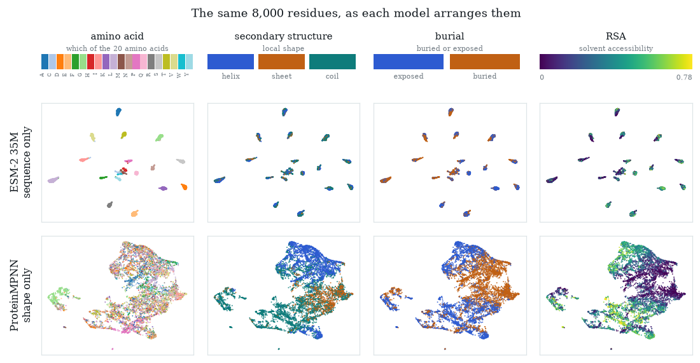

# Do a sequence model and a structure model learn the same biology?

[](https://github.com/Natalija-Stepurko/seq-structure-convergence/actions/workflows/tests.yml)
[](https://natalija-stepurko.github.io/seq-structure-convergence/)

One protein model reads only the amino-acid sequence (ESM-2); another reads only the backbone
coordinates (ProteinMPNN). If sequence and shape are two views of one biology, the two should end
up describing proteins the same way. This study measures whether they do, layer by layer, over
4,898 non-redundant protein domains (1,374,765 residues), and finds that about half of what the
standard measurements report as agreement is the training target the two models share.

**[Read the results →](https://natalija-stepurko.github.io/seq-structure-convergence/)** A
walkthrough written for biologists, with every figure and number built from this repository.



*The same 8,000 residues as each model arranges them. The sequence model sorts residues into
twenty islands, one per amino acid; colour the islands by anything structural and the colours mix
within each island. The structure model sorts the same residues by local shape and burial.*

## Findings

| | Evidence (ESM-2 35M × ProteinMPNN unless stated) |
|---|---|
| **About half the raw agreement is the shared training target.** Both families are trained to output amino-acid identity. Subtracting each residue's per-amino-acid mean removes it. | CKA 0.258 → 0.131. The control is checked both ways: two copies of ESM-1v that differ only by random seed stay at 0.849 → 0.849; an untrained sequence model drops from 0.205 → 0.038. |
| **The two share some axes, not a map.** | Mutual k-NN, the fraction of each residue's nearest neighbours the two models agree on: 0.030, against 0.796 for the two seeded copies. |
| **One standard measure is mostly its own null.** SVCCA finds shared directions between unrelated data, and more of them the wider the model. | SVCCA 0.415, of which 0.287 (69%) remains on scrambled residues; CKA and mutual k-NN keep 1% and 8%. In a width comparison, ESM-2 650M scores 0.598 against 0.408 for ESM-2 35M and sits the same distance above its own null. |
| **Each model knows what it was shown.** Best-layer probes, five refits each. | Structure wins residue geometry: solvent accessibility R² 0.816 vs 0.420, burial 0.892 vs 0.761, local shape 0.887 vs 0.786. Sequence wins function and evolution: fold topology F1 0.685 vs 0.489, enzyme class 0.550 vs 0.318, kingdom 0.688 vs 0.387. |
| **The structure model's description does not survive the sequence model's layers intact.** ProteinMPNN's output, mapped into ESM-2 at each layer and passed through ESM-2's remaining layers, scored against ProteinMPNN alone; 5 repeats per case. | Clearly worse in 77 of 108 cases, including every case entering in the first four layers; no clear difference in 28, better in 3. Untrained layers pass the information through unchanged. A neural-network connector changes nothing (10 of 12 worse); two sequence models (CARP → ESM-2) show no clear loss in 24 of 36. |

All intervals, controls and caveats are on the [results page](https://natalija-stepurko.github.io/seq-structure-convergence/).

## How the numbers are checked

- **A ladder of reference points for every score:** the same model trained twice (ceiling), two
  models sharing an input, untrained networks (floor), and a scrambled-residue null per measure.
- **Three measures, always together** (CKA, SVCCA, mutual k-NN), because they answer different
  questions and disagree severalfold on the same pair.
- **Intervals from whole-chain subsampling** (50 subsamples of 8,000 residues, without
  replacement), since residues within a chain are not independent.
- **Every number on the page is re-derived from `results/` on each build.** `site/audit.py`
  checks each headline number against its source file and fails the build on any mismatch; the
  [page workflow](.github/workflows/pages.yml) runs it before deploying.
- **The metric library is tested** for the properties the claims rest on: identity and rotation
  invariance, the cached SVCCA split, SVCCA's row cap and width-dependent null, chance levels
  ([`tests/test_metrics.py`](tests/test_metrics.py)).

## Repository layout

```
scripts/        the pipeline: 01_dataset → 02_extract → 03_geometry → 04_convergence
                → 05_probes → 06_stitching, one subcommand per stage
src/ssc/        shared metric library (CKA, SVCCA, mutual k-NN, k-NN purity, LVR, provenance)
tests/          tests for the metric library
results/        every derived result the page uses (~30 MB); index in results/README.md
site/           builds the results page from results/ and audits it
docs/           replication guide and figures
research/       literature review
```

## Reproducing

Rebuild the results page, with every number re-derived and audited, from a fresh clone:

```bash
pip install numpy && site/build.sh
```

Recomputing the results from structures needs the full pipeline, three Python environments and
~400 GB of disk: see **[docs/REPLICATION.md](docs/REPLICATION.md)**. What is and is not tracked, and
the licences of the upstream data and models, are in [DATA.md](DATA.md).

## Limits

- The structure models are inverse-folding encoders. No AlphaFold representation is measured, so
  nothing here speaks to how structure-prediction models encode proteins.
- The stitching connectors are a linear map and a one-hidden-layer network, fitted on frozen
  models; fine-tuning either model to accept the other's input was not tried.
- The chain set is CATH S35 domains with experimental structures; the scores are specific to that
  set and to the residue budgets stated with each number.

## Citation and licence

Code under the [MIT licence](LICENSE). To cite, use [CITATION.cff](CITATION.cff).
